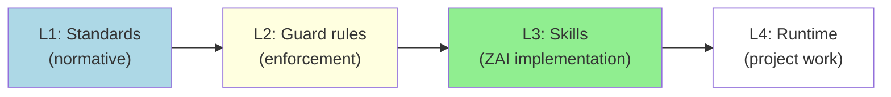

# Standard: Architecture & Repo Layout v1.2.0 (EN)

> ID: STD-ARCH-001
> Version: 1.2.0
> Previous: 1.1.2
> Level: **[C] Critical**
> Last Updated: 2026-07-06
> Effective Date: 2026-07-06
> Status: **APPROVED**
> verified_by: scripts/verify-id-graph.js#G02,G03,G04,G07
> Related: STD-META-001 (ID system)

> **Key invariants.** (1) The `Z-ai-governance` repository is a flat single
> repo with top-level directories `standards/`, `guard/`, `skills/`, `scripts/`,
> `graph/`, etc. (2) Layer assignment is exclusive -- an artifact lives in
> exactly one directory based on its ID prefix. (3) Cross-directory references
> MUST use ID form (per STD-META-001 §7.6), never file paths alone.
> (4) The layer model (L0-L3) determines which `Related:` edges are legal.

---

## 1. Purpose

This standard defines the canonical architecture of the Z-ai ecosystem
as a flat single repository (`Z-ai-governance`). It exists to answer
recurring questions that, before v1.0, were resolved ad-hoc and
inconsistently across `README.md`, `CONTRIBUTING.md`, and individual
rule files:

1. **Where does a new artifact live?** A new standard, a new rule, a new
   skill -- each has exactly one canonical directory based on its ID
   prefix. This standard codifies the mapping.
2. **How do artifacts reference each other?** References
   in prose, code comments, AI prompts, and HTML-comment markers MUST
   use ID form. File paths are unstable; IDs are permanent.
3. **What invariants must the directory layout preserve?** Predictable
   paths, clean separation of concerns, no inlined copies of files
   from one directory into another.
4. **What is the layer model and what does it constrain?** L0/L1/L2/L3
   is not just a labeling scheme -- it determines which `Related:`
   edges are legal (per STD-META-001 §6.1) and which CI checks run
   where.
5. **How does change propagation work?** Changes flow downward
   (L1 -> L2 -> L3 -> L4). A lower layer MUST NOT redefine semantics
   declared by a layer above it.

By answering these questions in one place, this standard eliminates the
divergence between `README.md` (informal), `CONTRIBUTING.md` (procedural),
and the ID graph (mechanical). When this standard conflicts with the
README, this standard wins.

---

## 2. Scope

This standard applies to:

- **All directories** in the `Z-ai-governance` repository: `standards/`,
  `guard/`, `skills/`, `scripts/`, `graph/`, and top-level files.
- **All artifacts** carrying an ID under STD-META-001 (i.e. all `STD-*`,
  `RULE-*`, `PROC-*`, `TOOL-*`, and `ZAI-*` artifacts).
- **All scripts** under `scripts/` that read or write across directories.
- **All CI workflows** under `.github/workflows/`.

This standard does NOT apply to:

- Consumer projects that consume skills as a plain git dependency.
  Such projects follow STD-SKILL-001, not this standard.
- Personal scratch repositories that have not been onboarded.
  They are out of scope until promoted.
- The internal layout of the Z.ai sandbox runtime at
  `/home/z/my-project/skills/` -- that is governed by STD-SKILL-001 §6.

When in doubt, this standard applies if and only if the artifact in
question carries an ID declared under STD-META-001.

---

## 3. Definitions

| Term                    | Definition                                                                                                                         |
| ----------------------- | ---------------------------------------------------------------------------------------------------------------------------------- |
| **Layer**               | One of L0 (root), L1 (standards), L2 (rules/procedures/tools), L3 (skills). Determines which `Related:` edges are legal.         |
| **ID form reference**   | A reference written as `<PREFIX>-<DOMAIN>-<NUMBER>` (e.g. `RULE-ARCH-016`), never as a bare file path or title.                   |
| **Cross-directory path** | A filesystem path that starts in one directory and references a file in another. MUST NOT appear in `Related:`/`Aligned_with:` headers; MAY appear in prose with an ID anchor. |
| **Top-level directory** | A directory at the root of `Z-ai-governance/` (e.g. `standards/`, `guard/`, `skills/`, `scripts/`).                              |

---

## 4. Directory Layout

### 4.1. Top-Level Structure

`Z-ai-governance` is a flat single repository. Its top-level layout is:

```text
Z-ai-governance/
  standards/          # L1: Standards (STD-*)
  guard/              # L2: Rules (RULE-*), Procedures (PROC-*), Tools (TOOL-*)
  skills/             # L3: Skills (ZAI-*)
  scripts/            # Verification and utility scripts
  graph/              # ID graph exports and visualizations
  .husky/             # Git hooks (pre-commit)
  .github/workflows/  # CI workflows
  README.md           # Overview of the platform
  CONTRIBUTING.md     # Contributor guide
  CHANGELOG.md        # Change log
  bootstrap.sh        # Bootstrap pre-commit hooks
```

### 4.2. Directory Purposes

| Directory     | Layer | Purpose                                                                                           |
| ------------- | ----- | ------------------------------------------------------------------------------------------------- |
| `standards/`  | L1    | Standards (`STD-*`), verifiers (`verify-standards.js`, `verify-id-graph.js`)                      |
| `guard/`      | L2    | Rules (`RULE-*`), procedures (`PROC-*`), tools (`TOOL-*`)                                         |
| `skills/`     | L3    | Skills (`ZAI-*`), skill catalog, skill runtime integration                                        |
| `scripts/`    | L0    | Shared verification and utility scripts                                                           |
| `graph/`      | L0    | ID graph exports, visualization data                                                              |

### 4.3. Predictable Paths

Each top-level directory MUST expose a predictable internal layout so that
`verify-id-graph.js` can find artifacts without per-directory configuration:

| Directory     | Required paths                                                       | Notes                                                                                                                                                          |
| ------------- | -------------------------------------------------------------------- | -------------------------------------------------------------------------------------------------------------------------------------------------------------- |
| `standards/`  | `standards/*.md`, `scripts/verify-*.js`                 | All `STD-*` files live in `standards/standards/`                                                                                                               |
| `guard/`      | `rules/*.md`, `INDEX.md`                                             | All `RULE-*` files live in `guard/rules/`                                                                                                                      |
| `skills/`     | `skills/<skill-name>/SKILL.md`, `skills/INDEX.md`                    | All `ZAI-*` skills live one level under `skills/`                                                                                                              |

### 4.4. No Inlined Copies

Files that live in one directory MUST NOT be copied into another directory.

This includes:

- Copying `standards/scripts/verify-id-graph.js` to
  `scripts/verify-id-graph.js` (a duplicate).
- Copying `guard/rules/RULE-ARCH-016.md` to
  `RULE-ARCH-016.md` at the repo root.
- Copying `skills/skills/skill-creator/SKILL.md` to
  `skill-creator.md` at the repo root.

Inlined copies drift from the canonical source within days. They are
FORBIDDEN. This extends RULE-ARCH-016 (immutability) to the
repository's own layout.

---

## 5. Layer Assignment

### 5.1. The Layer Model

Each artifact in the Z-ai ecosystem belongs to exactly one layer.
Layer membership is determined by the artifact's ID prefix per
STD-META-001 §2.1:

| ID prefix | Layer | Owning directory    | Repository path                                                                                                         |
| --------- | ----- | ------------------- | ----------------------------------------------------------------------------------------------------------------------- |
| (none)    | L0    | repo root           | top-level files (`README.md`, `CONTRIBUTING.md`, `bootstrap.sh`, `.husky/pre-commit`, `.github/workflows/*`, `scripts/*`) |
| `STD-`    | L1    | `standards/`        | `standards/standards/*.md`                                                                                              |
| `RULE-`   | L2    | `guard/`            | `guard/rules/*.md`                                                                                                      |
| `PROC-`   | L2    | `guard/`            | `guard/procedures/*.md` (currently inline in `rules/` per existing convention)                                          |
| `TOOL-`   | L2    | `guard/`            | `guard/tools/*` and `standards/scripts/verify-*.js`                                                                     |
| `ZAI-`    | L3    | `skills/`           | `skills/<skill-name>/SKILL.md`                                                                                     |

An artifact MUST NOT be moved between layers without recording the
change in the document's change history. Cross-layer moves follow the
protocol in STD-META-001 §8.

### 5.2. Layer Exclusivity

An artifact belongs to exactly one layer. There is no "shared" or
"cross-layer" artifact. Specifically:

- A `RULE-` artifact MUST NOT also be a `STD-` artifact. If a rule is
  promoted to a standard, the old `RULE-` ID is marked `[DEPRECATED]`
  with `superseded_by:` pointing to the new `STD-` ID per STD-META-001
  §8.1.
- A `ZAI-` skill MUST NOT also be a `STD-` standard. The migration of
  ZAI-META-001 content to STD-SKILL-001 (per STD-META-001 §8.4) is the
  canonical example: the skill file becomes a thin pointer, the
  standard file becomes the new home.
- A `TOOL-` artifact MUST NOT be defined inside a `ZAI-` skill. Tools
  live in `guard/tools/` or `standards/scripts/`; skills
  invoke tools, they do not declare them.

### 5.3. What Lives at L0

L0 (the repo root) contains ONLY:

- `README.md` -- overview of the platform, ID graph state, quick start.
- `CONTRIBUTING.md` -- how to make changes without breaking the ID graph.
- `bootstrap.sh` -- bootstrap pre-commit hooks.
- `.husky/pre-commit` -- pre-commit hook (invokes `verify-standards.js`).
- `.github/workflows/*.yml` -- CI workflows (currently `verify-id-graph.yml`).
- `scripts/` -- shared verification and utility scripts.
- `graph/` -- ID graph exports and visualizations.

L0 contains NO normative artifacts. It does not declare `STD-*`,
`RULE-*`, `PROC-*`, `TOOL-*`, or `ZAI-*` IDs. The root's role
is purely to organize and verify -- it does not itself carry ID-bearing
content.

This exclusivity is enforced by `verify-id-graph.js` G01 (no duplicate
IDs) implicitly: if the root declared an ID, it would either
duplicate an existing ID (failing G01) or introduce a new ID with no
`Related:` edges (triggering soft warning W03).

---

## 5A. Cascade State and Propagation Direction

This section formalizes the **direction of propagation** between the
layers. It is the normative answer to the question: "when a
standard changes, what else must change, and in what order?"

### 5A.1. Cascade diagram



### 5A.2. Direction rules

| Rule | Statement                                                                                                                       | Enforcement                                                                             |
| ---- | ------------------------------------------------------------------------------------------------------------------------------- | --------------------------------------------------------------------------------------- |
| C-1  | Changes propagate **downward** only (L1 -> L2 -> L3 -> L4).                                                                     | Code review; G04 layer matrix blocks upward edges.                                      |
| C-2  | No layer may redefine semantics declared by a layer above it.                                                                   | G04 + W03 (dead-standard warning catches orphan lower-layer artifacts).                 |
| C-3  | When a standard changes semantics, every RULE/ZAI/SKILL declaring `Related:` to it MUST be reviewed in the same release window. | Manual review checklist in PR template (TODO: link to CONTRIBUTING).                    |
| C-4  | When a RULE changes its enforcement contract, every skill declaring `Related:` to that RULE MUST be reviewed.                   | Same as C-3.                                                                            |
| C-5  | Runtime projects MUST NOT carry local copies of standards or rules.                                                             | Manual review.                                                                           |
| C-6  | A lower layer MAY propose a change to an upper layer, but only via a PR to the upper directory -- never via in-place edit at runtime. | RULE-ARCH-016 (immutability) + code review.                                             |

### 5A.3. Anti-patterns

These patterns are **forbidden** by the cascade model:

1. **Upward propagation.** A skill edit that silently changes the meaning of a standard. Blocked by G04 (STD <- ZAI is not allowed as a `Related:` edge -- skills can declare Related: to standards, but standards cannot declare Related: to skills).
2. **Local fork.** A runtime project that vendors a modified copy of a standard. Blocked by C-5 + RULE-ARCH-016.
3. **Silent enforcement.** A guard rule that enforces a standard the standard never declared. Caught by G02 (Related: must resolve) and W03 (orphan standard = no rule references it).
4. **Stale checkout.** A runtime project pinned to an old commit while a newer standard has shipped. Caught by nightly CI trigger (§10.3).

### 5A.4. Worked example: bumping STD-ENV-002 from v1.2 to v1.3

When ENV-002 §3.0 Bootstrap Procedure was added (2026-06-18), the
cascade produced these downstream reviews:

| Layer | Artifact                                                        | Required review action                                                                              | Result                                                  |
| ----- | --------------------------------------------------------------- | --------------------------------------------------------------------------------------------------- | ------------------------------------------------------- |
| L1    | `ENV-002-zai-integration.md` v1.3                               | Author the new §3.0 + bump version                                                                  | Done (commit `c0d1dbe`)                                 |
| L2    | `guard/rules/RULE-ENV-008.md` (if it enforces bootstrap)        | Verify rule still enforces correct section number; update if section moved                          | No rule currently enforces bootstrap -- no action needed |
| L3    | Skills declaring `Related: STD-ENV-002`                         | Verify skill instructions still match new §3.0                                                      | No skills currently declare this -- no action needed     |
| L4    | Runtime projects using this standard                            | Re-read standard at next session start; new §3.0 is purely additive (no existing semantics changed) | Will be picked up at next commit                         |

This example shows a **purely additive** L1 change -- cascade produced
zero downstream edits because no L2/L3 artifact declared a dependency
on the specific section number that moved.

### 5A.5. Cross-references

- §5 of this standard defines layer assignment; §5A defines the
  direction of propagation between those layers.
- §10.2 of this standard defines cross-directory HARD checks (G01-G15);
  §5A.2 above explains how G04 enforces cascade direction.
- `verify-id-graph.js` W03 warning catches L1 standards that no L2/L3
  artifact references (dead-standard signal -- cascade is broken at L1).
- `verify-id-graph.js` W13 warning (v1.1.0+) catches broken cross-doc
  references that would prevent cascade propagation from being
  machine-traceable.

---

## 6. Path References

### 6.1. ID Form is Mandatory in Headers

In `Related:` and `Aligned_with:` header fields, references MUST use
ID form (`RULE-ARCH-016`), never file paths (`guard/rules/RULE-ARCH-016.md`).
This is enforced by `verify-id-graph.js` G02 (references must resolve)
and G12 (format violations).

### 6.2. ID Form is Preferred in Prose

In prose (markdown body text, code comments, AI prompts), references
SHOULD use ID form. File paths MAY appear alongside IDs for navigation
convenience, but the ID MUST be present:

```markdown
<!-- GOOD -->

This procedure implements **RULE-ENV-008** by enforcing the sandbox
constraints declared in **STD-ENV-001**.

<!-- BAD -- file path alone, no ID -->

This procedure implements `guard/rules/RULE-ENV-008.md` by enforcing
the sandbox constraints declared in `standards/ENV-001-reproducibility.md`.
```

### 6.3. Paths in Scripts

Scripts that need to invoke files across directories MUST
resolve paths relative to the repository root, not relative to the
script's own location.

```javascript
// GOOD -- resolve from repo root
const repoRoot = path.resolve(__dirname, "..", "..", "..");
const verifyScript = path.join(repoRoot, "standards", "scripts", "verify-id-graph.js");

// BAD -- assumes cwd, breaks when invoked from elsewhere
const verifyScript = "standards/scripts/verify-id-graph.js";
```

The `verify-id-graph.js` script itself follows this convention: it
discovers the repository by walking up from its own location
until it finds `.git/`, then resolves `standards/`, `guard/`,
`skills/` relative to that root.

### 6.4. Paths in CI Workflows

CI workflows in `.github/workflows/*.yml` MUST use paths relative to
the repository root, because GitHub Actions checks out the repository
at the workspace root by default.

---

## 7. Validation Matrix

### 7.1. Per-Directory Checks

Each directory has its own structural checks run by CI:

| Directory     | Check                                     | Tool                               | Strictness |
| ------------- | ----------------------------------------- | ---------------------------------- | ---------- |
| `standards/`  | Header format conforms to STD-META-001 §5 | `verify-standards.js` V05/V11      | HARD       |
| `standards/`  | Registry sync (§4 of each STD file)       | `verify-standards.js` V05 extended | HARD       |
| `standards/`  | `Related:` references resolve within dir  | `verify-standards.js` V12          | HARD       |
| `guard/`      | Rule headers conform to format            | `verify-standards.js` V05          | HARD       |
| `guard/`      | Rule registry sync                        | `verify-standards.js` V05 extended | HARD       |
| `skills/`     | YAML frontmatter parses                   | `verify-standards.js` V13a         | HARD       |
| `skills/`     | Required fields present                   | `verify-standards.js` V13b         | HARD       |
| `skills/`     | `name` matches folder                     | `verify-standards.js` V11b         | HARD       |

### 7.2. Cross-Directory Checks

The repository's CI runs cross-directory checks (the
`verify-id-graph.yml` workflow). These checks require all directories
to be checked out simultaneously.

| Check                                  | Tool                 | Strictness | What it validates                                            |
| -------------------------------------- | -------------------- | ---------- | ------------------------------------------------------------ |
| G01: No duplicate IDs across dirs      | `verify-id-graph.js` | SOFT       | Two artifacts in different dirs don't claim the same ID      |
| G02: All `Related:` references resolve | `verify-id-graph.js` | HARD       | Every `Related:` target exists somewhere in the graph        |
| G03: No cycles in `Related:` graph     | `verify-id-graph.js` | HARD       | The directed graph has no cycles                             |
| G04: Layer matrix respected            | `verify-id-graph.js` | HARD       | `Related:` edges conform to STD-META-001 §6.1                |
| G07: No STD -> (RULE/PROC/TOOL/ZAI)    | `verify-id-graph.js` | HARD       | Standards are self-contained (this standard's §5.2)          |
| G14: Compatibility DAG valid for ZAI   | `verify-id-graph.js` | HARD       | Skill compatibility fields respect STD-META-001 §6.4         |
| G15: Aligned_with has Related edge     | `verify-id-graph.js` | HARD       | Aligned_with declarations are backed by a dependency         |

### 7.3. CI Triggers

The repository's CI workflow triggers on:

1. **Push to `main`** in `Z-ai-governance`.
2. **Pull request to `main`** (covers proposed changes before merge).
3. **Nightly at 03:00 UTC** (catches drift or issues that develop
   between pushes).
4. **Manual dispatch** via GitHub Actions UI (for debugging).

---

## 8. Known Issues and Proposed Solutions

This section documents discovered inconsistencies, missing content, and proposed corrections. Each issue has an ID, status, and proposed action. Issues resolved in the current version are marked `[RESOLVED]`; outstanding issues are marked `[OPEN]`.

### ARCH-001-001 `[RESOLVED in v1.1]` -- No Known Issues section (W12 warning)

**Problem:** v1.0 had no Known Issues section. verify-id-graph.js v1.1.0 W12 warning flagged this as inconsistent with the convention established in ENV-002 v1.2 §10A.

**Resolution:** This section added in v1.1. Convention now followed.

### ARCH-001-002 `[OPEN]` -- §5A.3 references planned verifier `verify-standards.js V14` that does not exist yet

**Problem:** §5A.3 anti-pattern #2 says "Blocked by C-5 + RULE-ARCH-016". §5A.2 rule C-5 says "manual review". There is no automated check for local forks of standards in runtime projects.

**Proposed solution:** Implement a check that scans project tree for files matching `standards/<DOMAIN>-<NNN>-<name>.md` pattern that are NOT part of the repository. Lower priority than W13 sweep and other open items.

### ARCH-001-003 `[OPEN]` -- §5A.4 worked example hardcodes commit SHA `c0d1dbe`

**Problem:** §5A.4 references commit `c0d1dbe` as the example. Over time this SHA will become stale as the repository advances.

**Proposed solution:** Either (a) replace the SHA with a relative reference ("the commit that introduced §3.0"), or (b) accept the staleness as documentation of when the example was authored. Lean towards (b) -- historical context is useful for understanding the example.

### ARCH-001-004 `[OPEN]` -- §5A references planned artifacts not yet shipped (RULE-ENV-008, skills/INDEX.md, doctor.sh)

**Problem:** §5A cascade diagram and worked example reference artifacts that do not exist yet:

- `guard/rules/RULE-ENV-008.md` (planned rule for bootstrap enforcement)
- `skills/skills/INDEX.md` (planned skills tree index)
- `doctor.sh` (planned diagnostics script)

These references are intentional -- they describe the target state of the cascade model, not the current state. Without them, the cascade section would describe only what exists today, not what the architecture is building toward.

**Resolution (partial):** As of verify-id-graph.js v1.1.2, these planned references are in the W13 whitelist (see `W13_WHITELIST` constant in `scripts/verify-id-graph.js`). They do not generate W13 warnings. When the planned artifacts ship, they should be removed from the whitelist so the verifier catches any future breakage.

**Proposed solution:** Track in issue tracker: (1) create `RULE-ENV-008.md` when bootstrap enforcement rule is needed, (2) create `skills/skills/INDEX.md` when skills tree grows past 50 entries, (3) create `doctor.sh` when CI diagnostics are needed. Each creation triggers whitelist cleanup.

---

## 9. Related Artifacts

- **STD-META-001** -- ID system that defines prefixes, layers, and the
  `Related:`/`Aligned_with:` edge semantics. This standard depends on
  STD-META-001 for its vocabulary.
- **STD-DOC-002** -- Documentation conventions (header formats, section
  ordering, cross-reference syntax). This standard follows STD-DOC-002
  for its own document structure.
- **RULE-ARCH-016** (in `guard/`) -- Immutability rule.
  This standard formalizes the architecture that RULE-ARCH-016
  protects. The rule references this standard via its own `Related:`
  field (RULE -> STD is allowed per STD-META-001 §6.1).
- **RULE-ARCH-017** (in `guard/`) -- Upstream write protection
  rule. This standard defines the layer structure that
  RULE-ARCH-017 governs write access to.
- **`README.md`** -- Informal overview of the platform.
  When in conflict, this standard wins.
- **`CONTRIBUTING.md`** -- Procedural guide for
  contributors. Procedural details (e.g. "how to run the verifier
  locally") live in CONTRIBUTING.md; normative requirements live in
  this standard.

---

## 10. Change History

| Version | Date       | Changes                                                                                                                                                                                                                                                                                                                                                                                                                        |
| ------- | ---------- | ------------------------------------------------------------------------------------------------------------------------------------------------------------------------------------------------------------------------------------------------------------------------------------------------------------------------------------------------------------------------------------------------------------------------------ |
| 0.1.0   | 2026-06-17 | Stub. Reserved the ID. Listed intended scope.                                                                                                                                                                                                                                                                                                                                                                                  |
| 1.0.0   | 2026-06-17 | Full normative standard. Adds: directory layout (§4), layer assignment (§5), directory conventions (§6), path references (§7), validation matrix (§10). Promoted from `[B] Recommended` to `[C] Critical`.                                                                                                                                                                                                                   |
| 1.1.0   | 2026-06-18 | Added §5A Cascade State and Propagation Direction (cascade diagram, 6 direction rules C-1..C-6, 4 anti-patterns, worked example for STD-ENV-002 v1.2 -> v1.3 bump). Added §8 Known Issues (ARCH-001-001 resolved, ARCH-001-002/003 open). Closes W12 warning on this file.                                                                                                                                                   |
| 1.1.1   | 2026-06-18 | Added ARCH-001-004 Known Issue (§5A references to planned artifacts documented, W13 whitelist in verify-id-graph.js v1.1.2 covers them).                                                                                                                                                                                                                                                                                       |
| 1.1.2   | 2026-06-18 | Retired dead scripts. Dropped `verify-cascade.js` from §4.1 L1 verifier list (TOOL-VERIFY-003 RETIRED in META-001 §4.15). Dropped `scripts/*.js` from §5 L0 layout (parent `scripts/` directory removed -- was empty after `cross-validator-test.js` deletion). Replaced §6.2 reference to `cross-validator-test.js` with the actual live verifiers (`verify-standards.js` + `verify-id-graph.js` run by pre-commit hook + CI). |
| 1.2.0   | 2026-07-06 | Rewrote for flat single-repo architecture. Updated definitions, directory layout, and validation matrix. Replaced PlantUML cascade diagram with Mermaid.     |